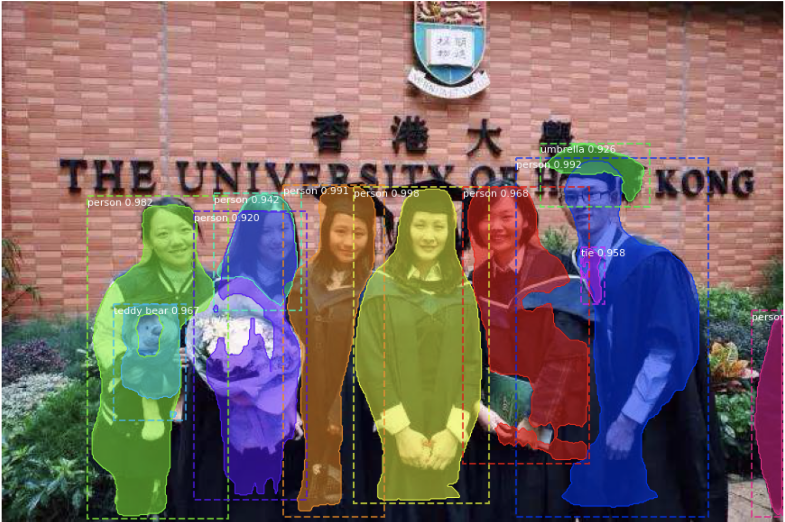
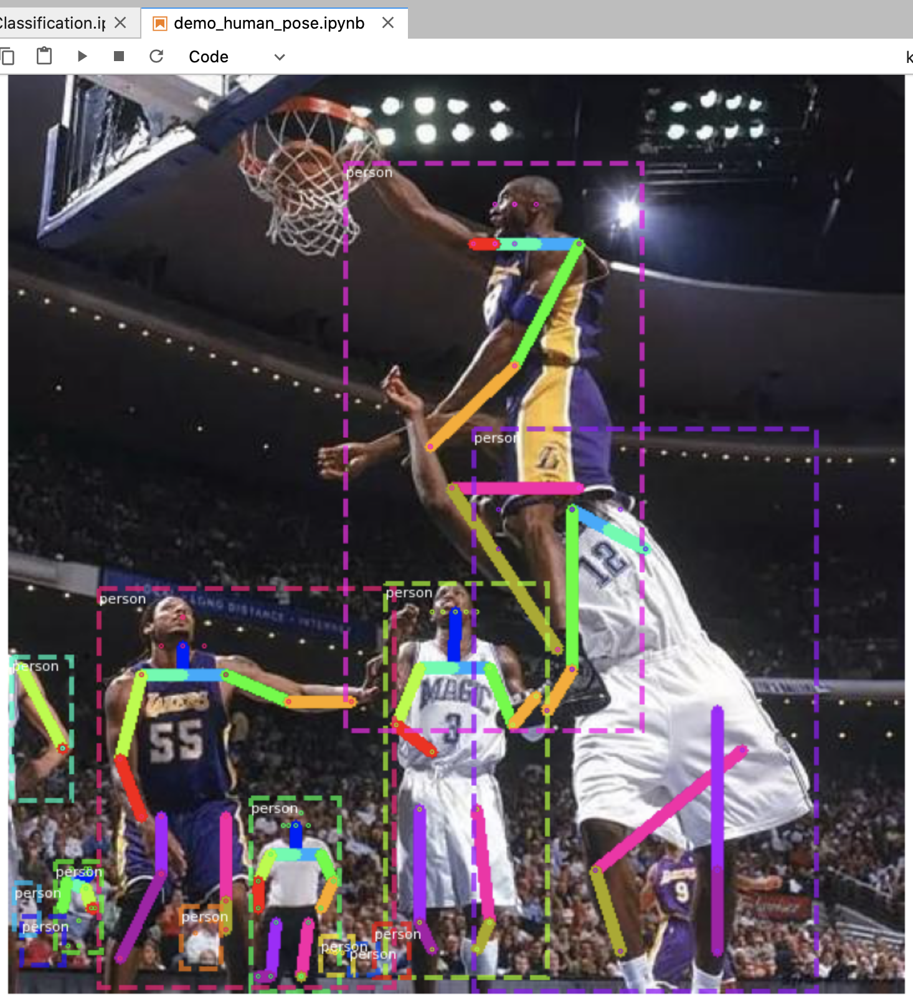
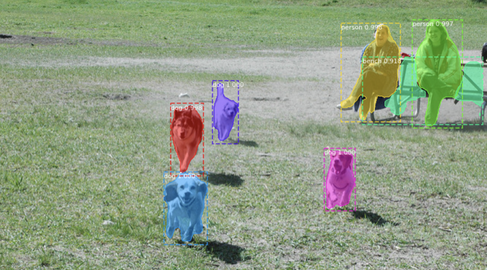

# COMP7404 Group 17 -- Mask R-CNN
This is the Manipulate and execute of [Mask R-CNN](https://arxiv.org/abs/1703.06870) on Python 3, Keras, and TensorFlow. The model generates bounding boxes and segmentation masks for each instance of an object in the image. It's based on Feature Pyramid Network (FPN) and a ResNet101 backbone.



# Getting Started
* ([instanceSegmentation.ipynb](instanceSegmentation.ipynb)): This file contains the implementation of Mask R-CNN for Object Detection and Segmentation. 
* ([humanPostureDemo.ipynb](humanPostureDemo.ipynb)): This file contains the implementation of Mask RCNN for Human Pose Estimation. 

# Installation
1. create a conda virtual environment with python 3.6
2. Clone this repository
3. Install dependencies
   ```bash
   pip3 install -r requirements.txt
   ```
4. Run setup from the repository root directory
    ```bash
    python3 setup.py install
    ``` 
5. Download pre-trained COCO weights (mask_rcnn_coco.h5) from the [releases page](https://github.com/alittleanimal/Mask_RCNN/releases/download/v3.1/mask_rcnn_coco.h5.zip).
6. Download pre-trained COCO weights for human pose (mask_rcnn_coco_humanpose.h5) from the [releases page](https://github.com/alittleanimal/Mask_RCNN/releases/download/v3.1/mask_rcnn_coco_humanpose.h5).
7. Run [MaskRCNNClassification.ipynb](MaskRCNNClassification.ipynb) and [demo_human_pose.ipynb](demo_human_pose.ipynb) correctly in Jupyter Notebook.

# Using the HKU CS GPU Farm
1. Visit https://intranet.cs.hku.hk/gpufarm_acct_cas/ for application
2. Accessing the GPU Farm by 
   ```bash
   ssh -X <your_portal_id>@gpu2gate1.cs.hku.hk
   ```
3. Software Installation such as Anaconda, Tensorflow
4. Running Jupyter Lab without Starting a Web Browser

# Useful Tips
1. Reference package version list below, there could be some conflicts if the version was not suitable
  * python             3.6.12  
  * tensorflow-gpu     1.14.0
  * keras              2.0.8
  * opencv3            3.1.0  
  * scipy              1.2.1 
  * h5py               2.10.0 
2. If you want to train your own dataset, you can start by reading this [blog post about the balloon color splash sample](https://engineering.matterport.com/splash-of-color-instance-segmentation-with-mask-r-cnn-and-tensorflow-7c761e238b46). It covers the process starting from annotating images to training to using the results in a sample application.

# Instance Segmentation and Human Pose Estimation Sample





# Projects Using this Model (Getting from original github)
If you extend this model to other datasets or build projects that use it, we'd love to hear from you.

### [4K Video Demo](https://www.youtube.com/watch?v=OOT3UIXZztE) by Karol Majek.
[](https://www.youtube.com/watch?v=OOT3UIXZztE)

### [Images to OSM](https://github.com/jremillard/images-to-osm): Improve OpenStreetMap by adding baseball, soccer, tennis, football, and basketball fields.


### [Splash of Color](https://engineering.matterport.com/splash-of-color-instance-segmentation-with-mask-r-cnn-and-tensorflow-7c761e238b46). A blog post explaining how to train this model from scratch and use it to implement a color splash effect.


### [Segmenting Nuclei in Microscopy Images](samples/nucleus). Built for the [2018 Data Science Bowl](https://www.kaggle.com/c/data-science-bowl-2018)
Code is in the `samples/nucleus` directory.


### [Detection and Segmentation for Surgery Robots](https://github.com/SUYEgit/Surgery-Robot-Detection-Segmentation) by the NUS Control & Mechatronics Lab.


### [Reconstructing 3D buildings from aerial LiDAR](https://medium.com/geoai/reconstructing-3d-buildings-from-aerial-lidar-with-ai-details-6a81cb3079c0)
A proof of concept project by [Esri](https://www.esri.com/), in collaboration with Nvidia and Miami-Dade County. Along with a great write up and code by Dmitry Kudinov, Daniel Hedges, and Omar Maher.


### [Usiigaci: Label-free Cell Tracking in Phase Contrast Microscopy](https://github.com/oist/usiigaci)
A project from Japan to automatically track cells in a microfluidics platform. Paper is pending, but the source code is released.

 

### [Characterization of Arctic Ice-Wedge Polygons in Very High Spatial Resolution Aerial Imagery](http://www.mdpi.com/2072-4292/10/9/1487)
Research project to understand the complex processes between degradations in the Arctic and climate change. By Weixing Zhang, Chandi Witharana, Anna Liljedahl, and Mikhail Kanevskiy.


### [Mask-RCNN Shiny](https://github.com/huuuuusy/Mask-RCNN-Shiny)
A computer vision class project by HU Shiyu to apply the color pop effect on people with beautiful results.


### [Mapping Challenge](https://github.com/crowdAI/crowdai-mapping-challenge-mask-rcnn): Convert satellite imagery to maps for use by humanitarian organisations.


### [GRASS GIS Addon](https://github.com/ctu-geoforall-lab/i.ann.maskrcnn) to generate vector masks from geospatial imagery. Based on a [Master's thesis](https://github.com/ctu-geoforall-lab-projects/dp-pesek-2018) by Ondřej Pešek.

